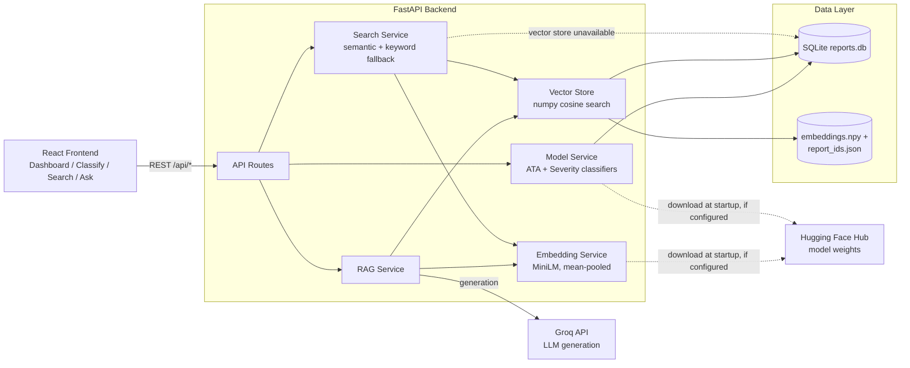

# Maintenance Log Classifier

Classifies aviation maintenance narratives by ATA chapter and severity, and provides semantic search and grounded Q&A over the report corpus.

## Problem

Aviation maintenance and safety narratives are submitted as free text — voluntary, unstructured reports describing what happened during an inspection or incident. Manually reading through a large corpus of these to find the relevant system, gauge severity, or answer a specific question ("what usually causes X?") doesn't scale. This project automates ATA-chapter and severity classification of individual narratives, and lets you search and ask questions across the whole corpus using semantic similarity rather than exact keyword matching.

## Architecture

A FastAPI backend serves two fine-tuned DistilBERT classifiers, a sentence-embedding search index, and a small retrieval-augmented Q&A layer over a SQLite-backed corpus of ASRS (Aviation Safety Reporting System) narratives. A React/Vite frontend consumes this as a plain REST API. Model weights aren't committed to git (too large); the backend downloads them from Hugging Face Hub at startup if configured, or reads them from a local `models/` folder in dev.



## Tech stack

| Layer | Technology |
|---|---|
| Backend framework | FastAPI 0.139.0, Uvicorn 0.51.0 |
| ML runtime | PyTorch 2.11.0, Transformers 5.13.1 |
| Model distribution | huggingface_hub 1.23.0 |
| Database | SQLite (stdlib `sqlite3`, no ORM) |
| Vector search | NumPy 2.4.6 (brute-force cosine similarity, no vector DB) |
| LLM generation (RAG) | Groq API, `llama-3.1-8b-instant` |
| Frontend | React 18.3.1, React Router 6.28.0 |
| Charts | Recharts 2.13.3 |
| Build tooling | Vite 6.0.3, Tailwind CSS 3.4.15 |

## Models

Three fine-tuned/adapted models, hosted on Hugging Face Hub:

- **[ATA Chapter Classifier](https://huggingface.co/Satyam311/maintenance-ata-classifier)** — DistilBERT, fine-tuned, 16-class single-label text classification. Test set: 79.8% accuracy, 0.750 macro F1 (228 held-out examples). Just under the project's 80% accuracy target.
- **[Severity Classifier](https://huggingface.co/Satyam311/maintenance-severity-classifier)** — DistilBERT architecture (matches `distilbert-base-uncased`), 3-class (Low/Medium/High). Test set: 48.9% accuracy, 0.464 macro F1 (411 held-out examples) — well below the 0.70 macro-F1 target. Its training script is not in this repo, only its evaluation script; treat its predictions as a rough, low-confidence signal.
- **[Embedding Model](https://huggingface.co/Satyam311/maintenance-embedding-model)** — `nreimers/MiniLM-L6-H384-uncased` base (384-dim), used as-is (no domain fine-tuning script exists) with a hand-written mean-pooling + L2-normalize step, not the `sentence-transformers` package. Powers `/search` and `/ask`.

All three model cards document exact base checkpoints, label sets, and evaluation numbers pulled directly from this repo's `reports/*/metrics.json` and model `config.json` files.

## Setup / running locally

### Backend

```
python -m venv .venv
.venv\Scripts\activate          # Windows
pip install -r requirements.txt
```

Copy `.env.example` to `.env` and fill in:
- `MODEL_DIR`, `DATABASE_URL`, `CHROMA_PERSIST_DIR`, `ENV` — standard defaults work for local dev.
- `HF_ATA_MODEL_REPO`, `HF_SEVERITY_MODEL_REPO`, `HF_EMBEDDING_MODEL_REPO` — only needed if `models/` isn't already populated locally; if set, the backend downloads weights from Hugging Face Hub at startup.
- `LLM_API_KEY` — only needed for `/ask`'s generation step (Groq); retrieval works without it, generation degrades gracefully to "showing retrieved sources only."

```
uvicorn api.main:app --reload
```

**Gotcha:** semantic search and `/ask` both depend on `data/processed/embeddings.npy` + `report_ids.json` existing. If they're missing, `/search` silently degrades to keyword-only matching and `/ask` returns "No relevant reports found" for every question — not a bug, just an unbuilt index. Build it once `reports.db` exists:

```
python training/build_embeddings.py --db data/processed/reports.db --out data/processed
```

`uvicorn --reload`'s file watcher only tracks `.py` files, so if you build the embeddings index while the server is already running, **restart it** — it won't pick up new data files on its own.

### Frontend

```
cd frontend
npm install
npm run dev
```
Proxies `/api` to `http://localhost:8000` (see `vite.config.js`).

### Training pipeline

Run in order against a raw ASRS CSV export in `data/raw/`:
```
python training/preprocess.py --input data/raw/<file>.csv --db data/processed/reports.db
python training/build_embeddings.py --db data/processed/reports.db --out data/processed
python training/build_labels.py --csv data/raw/<file>.csv --db data/processed/reports.db
python training/split_dataset.py --db data/processed/reports.db --out data/processed
python training/train_ata_classifier.py
python training/evaluate.py
python training/evaluate_severity.py
```

**Gotcha:** `requirements.txt` only covers the API runtime. The training scripts additionally need `pandas`, `scikit-learn`, `matplotlib`, `joblib`, and `datasets` — none of these are pinned anywhere; install them manually before running training scripts.

## API endpoints

| Method | Path | Description |
|---|---|---|
| GET | `/health` | Liveness + model-load status |
| POST | `/classify` | Classify a narrative (ATA chapter + severity) |
| GET | `/search` | Semantic search, with keyword-only fallback |
| POST | `/corrections` | Submit a correction to a prediction |
| POST | `/ask` | Retrieval-augmented Q&A over the corpus |
| GET | `/stats` | Dashboard aggregate stats |
| GET | `/model-performance` | Real evaluation metrics for both classifiers |
| GET | `/reports/*` | Static confusion-matrix images |

## Known limitations

- **Single-label classification only.** Each narrative gets one ATA chapter and one severity level; `/classify` surfaces the next two highest-scoring ATA chapters as "other possible systems," but there's no true multi-label modeling.
- **No authentication.** By MVP design — anyone with network access to the API can classify, search, submit corrections, or ask questions.
- **Severity model underperforms its target** (0.464 macro F1 vs. a 0.70 target) and its training script isn't in this repo, so it can't be reproduced or audited from this snapshot. Treat severity predictions as a rough signal, not a reliable one.
- **ATA classifier is just under its accuracy target** (79.8% vs. 80%), and per-class performance varies widely with test-set size — some classes have as few as 2-3 test examples.
- **`25-EM` is a project-defined label, not a real ATA chapter number.** It buckets emergency-equipment narratives (escape slides, life vests, smoke detectors, fire extinguishers) that don't map to one standard ATA chapter. This is a documented modeling decision, not a data gap.
- **Severity labels are derived, not annotated.** They come from a documented heuristic over several ASRS fields, not human-labeled ground truth — this caps how learnable and how trustworthy the severity task can be.
- **`/search`'s `date_from`/`date_to` query parameters are accepted but not actually applied** — a pre-existing gap between the route and the search service, not touched in recent fixes.
- **Training dependencies are unpinned** (see Setup above).
- **Not a certified aviation safety tool.** Trained on public, de-identified ASRS data for research/portfolio purposes.

## Results

Two verified, real examples (not illustrative — actual API responses from this running system):

**Classification.** Input: *"Crew reported hydraulic leak near landing gear during pre-flight inspection."* The model correctly identifies the primary system as **Hydraulic Power (ATA 29)** at 59.5% confidence, and — because the narrative genuinely is ambiguous between two plausible systems — surfaces **Landing Gear (ATA 32)** at 10.4% and **Electrical Power (ATA 24)** at 3.6% as other possible systems, rather than hiding that ambiguity. Severity is classified as **High** at 97.3% confidence.

**Retrieval-augmented Q&A.** Question: *"what are common causes of landing gear failing to extend?"* The system retrieves 5 relevant source reports by semantic similarity and generates a grounded answer citing specific causes found in those reports — bolt failure in a landing gear wheel assembly, a stuck pull knob disabling the emergency gear extension system, and general damage/security issues with landing gear hardware — explicitly noting where the retrieved excerpts don't cover other possible causes (e.g. electrical or hydraulic malfunctions) rather than speculating beyond the source material.
